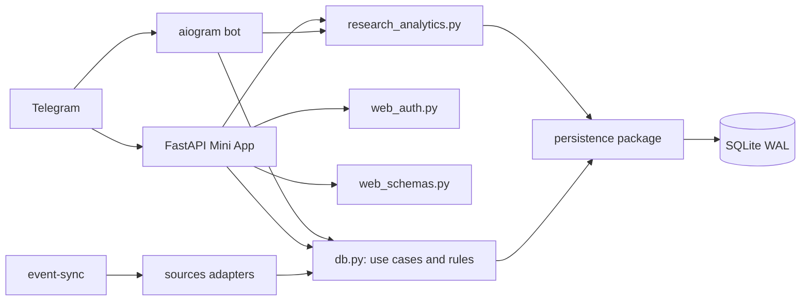

# Архитектура Мск.Митап

Актуально на 1 сентября 2026 года. Проект остаётся монолитом на Python: это
осознанно проще для текущей нагрузки, но границы между транспортом,
валидацией, инфраструктурой и бизнес-правилами теперь явные.

## Процессы

- `event-bot` принимает Telegram-команды, отправляет подборки, уведомления и
  ежедневную админскую сводку, а также напоминания компаниям и опрос после встречи.
- `event-web` обслуживает подписанный Telegram Mini App API и статический
  интерфейс.
- `event-sync` раз в сутки импортирует события из настроенных источников и
  обновляет эмбеддинги.

Все процессы разделяют `data/bot.db`. Соединения открываются через
`event_bot.persistence.connection`: включены WAL, `busy_timeout` и проверка
внешних ключей. Создание схемы и безопасные additive-миграции находятся в
`event_bot.persistence.schema`.

## Продуктовый поток

1. Пользователь сохраняет интересы, дни, бюджет и желаемый размер компании.
2. `find_events` фильтрует активные будущие события по городу, времени и
   бюджету, затем ранжирует их по эмбеддингам или тегам.
3. Нажатие «Найти компанию» относится только к выбранному мероприятию.
4. `join_event_group` атомарно присоединяет пользователя к совместимой
   формирующейся компании или создаёт новую.
5. Компания активируется при достижении точного целевого размера 2–5. Внутри доступны RSVP,
   чат, место встречи, взаимное открытие Telegram-контактов, жалоба и блокировка.
6. Перед событием планировщик напоминает о встрече, после — собирает исход и архивирует группу.

Старая система постоянных групп по интересам удалена из моделей, API и
аналитики. Её исторические таблицы не удаляются автоматически из существующей
базы, чтобы обновление оставалось обратимым.

## Границы модулей

- `webapp.py` — маршруты, преобразование ответов и оркестрация Mini App.
- `web_auth.py` — единственная реализация проверки Telegram `initData`.
- `web_schemas.py` — входные Pydantic-схемы API.
- `db.py` — запросы и транзакционные продуктовые правила.
- `persistence/` — политика соединений, DDL и миграции.
- `sources/` — независимые адаптеры внешних каталогов мероприятий.
- `analytics.py` и `admin_dashboard.py` — сбор метрик и представление для
  администратора.
- `research_analytics.py` — изолированные UX-когорты, псевдонимные коды,
  сессии, исследовательская воронка и безопасный CSV-экспорт.

Исследовательские ссылки используют префиксы `ux_` и `research_`. Участник
получает случайный код вместо Telegram ID; заголовок `X-Research-Session`
связывает события одного запуска Mini App. Исследовательские пользователи не
попадают в общие KPI и собираются в компании только с участниками той же
кампании.

Следующая граница масштабирования — перенос доменных запросов из `db.py` в
модули `profiles`, `events`, `companies` и `analytics`. Делать это нужно
поэтапно вместе с тестами, без замены FastAPI, aiogram или Docker.
